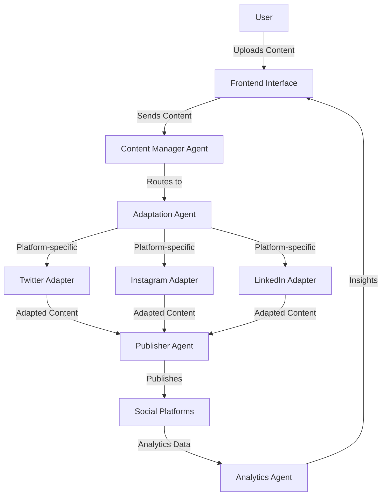

### Platform Architecture & Workflow

#### System Overview
ChapChap is a Django-based social media management platform that enables users to create, adapt, schedule, and publish content across multiple social platforms from a centralized interface. The application follows a Model-View-Template (MVT) architecture with an agentic approach to content processing.

### Implementation Roadmap

#### Phase 1: UI/UX and database
This phase involved building the necessary pages, as well as setting up the database schema.

#### Phase 2: Agent Integration 
Here we create an agents app in the django codebase where we house all the code for the agentic system. 
In this phase, we buld the agentic system that can take input text, adapt it for various social media platforms and return it to the backend. 

#### Phase 3: Publishing System 
Here we add ai agents to handle automatic posting of the adapted content to the relevant social media platforms. Access to the platforms is granted by the APIs to the various platforms.

### Agentic Workflow Sequence
1. User submits content via `/create`
2. System creates `Content` object
3. Content Manager:
   - For each selected platform:
   - Triggers Adaptation Agent
   - Stores adapted content
   - Creates scheduled job
4. At scheduled time:
   - Publisher Agent posts content
   - Stores platform ID in `PublishedPost`
5. Daily Analytics Agent:
   - Fetches engagement metrics
   - Runs sentiment analysis
   - Updates dashboard

#### Agent Communication Flow


#### Key Agents:
1. **Content Manager Agent** (Orchestrator)
   - Manages workflow
   - Stores content in DB
   - Triggers adaptation

2. **Adaptation Agent**
   - Uses Hugging Face/Openai models
   - Platform-specific sub-agents:
     * Twitter: Shortens text, adds hashtags
     * Instagram: Generates emoji-rich captions
     * LinkedIn: Professional tone conversion

3. **Publisher Agent**
   - Handles scheduling via APScheduler
   - API integrations
   - Error handling

4. **Analytics Agent**
   - Basic TextBlob sentiment analysis
   - Engagement metrics collection
   - Simple dashboard formatting

### Frontend Skeleton 

#### Core Pages (5 Total):
1. **Dashboard** (`/`)
   - Upcoming posts calendar
   - Quick stats (total posts, engagement rate)
   - "Create New" button

2. **Content Creation** (`/create`)
   - Minimal form:
     * Text area (main content)
     * File upload (image/video)
     * Platform checkboxes (Twitter, Instagram, LinkedIn)
     * Schedule picker
   - Preview panel (show adapted content per platform)

3. **Accounts Management** (`/accounts`)
   - Connected platforms list
   - "Connect" buttons for new platforms
   - Disconnect option

4. **Analytics** (`/analytics`)
   - Engagement metrics cards (likes, shares, comments)
   - Sentiment gauge (positive/neutral/negative)
   - Simple line chart (engagement over time)

5. **Settings** (`/settings`)
   - Timezone selection
   - AI tone preference (Professional/Casual/Enthusiastic)
   - Notification preferences

#### UI Approach:
- **Framework**: Django Templates + Tailwind CSS (CDN)
- **Navigation**: Left sidebar (collapsible on mobile)
- **Color Scheme**: 
  - Primary: Indigo (#6366f1) 
  - Background: Light gray (#f3f4f6)
- **Components**: 
  - Cards for content blocks
  - Simple tables for data
  - Modal dialogs for actions

#### User Journey & Page Connections
1. **User Registration & Authentication**
   - New users begin at `/signup` to create an account using Django's authentication system
   - Returning users access `/login` with credentials
   - Both routes redirect to the Dashboard upon successful authentication

2. **Dashboard Flow** (`/`)
   - Entry point after authentication
   - Displays upcoming scheduled posts fetched from the `Content` model
   - Shows engagement metrics aggregated from the `PublishedPost` model
   - "Create New" button links to the Content Creation page
   - "View All" button connects to the All Posts page
   - Each upcoming post links to its detailed view

3. **Content Creation Flow** (`/create`)
   - Form submission creates a new `Content` object in the database
   - Platform selection checkboxes determine which adapters process the content
   - When "Preview" is clicked:
     * AJAX request to `/generate-preview/` endpoint
     * Backend calls `adapt_content()` with selected platforms
     * Returns JSON with platform-specific adaptations
     * JavaScript updates the preview panel
   - "Save Draft" saves content with future publishing date
   - "Publish Now" calls `publish_content()` immediately

4. **Accounts Management Flow** (`/accounts`)
   - Lists connected accounts from `SocialAccount` model
   - "Connect" buttons redirect to OAuth flows:
     * Routes to `/connect/<platform>/`
     * External OAuth authentication at provider
     * Callback saves tokens to `SocialAccount` model
   - "Disconnect" buttons call `/disconnect/<platform_id>/` endpoint

5. **All Posts Flow** (`/posts/`)
   - Lists all content items from `Content` model filtered by user
   - Each post links to detailed view at `/posts/<post_id>/`
   - Detail view shows original content, adaptations, and metrics
   - Includes options to edit, delete, or publish content

6. **Settings Flow** (`/settings/`)
   - Form updates `UserSettings` model
   - Changes affect how adaptation agents process future content

#### Backend Architecture & Data Flow

1. **URL Routing**
   - Main URLs in `chapchap/urls.py` handle authentication routes
   - App-specific routes in `core/urls.py` manage feature endpoints
   - Each view function is protected with `@login_required` decorator

2. **View Controllers**
   - Views in `core/views.py` handle HTTP requests and responses
   - Process form data (POST) and return templates (GET)
   - Call agent functions for content processing
   - Fetch appropriate data from models for templates

3. **Template Rendering**
   - Base template (`core/base.html`) provides layout and navigation
   - Page-specific templates extend the base and fill content blocks
   - Templates use context variables from views to display dynamic data
   - Forms leverage Django's form handling for validation

4. **Data Processing Pipeline**
   ```
   User Input → Form Validation → Model Storage → Agent Processing → Database Update → View Rendering
   ```

5. **Scheduling System**
   - Django APScheduler integration in `core/apps.py`
   - Scheduler starts when application loads
   - `schedule_content()` adds jobs to scheduler
   - Jobs call `publish_scheduled_posts()` at specified times
   - Successful publishes create `PublishedPost` entries

6. **Content Adaptation Process**
   ```
   Original Content → Content Manager → Platform-specific Adapters → Adapted Content
   ```
   - Each adapter applies transformations based on platform rules
   - Transformations include:
     * Text length adjustments
     * Hashtag generation
     * Tone modification
     * Media format adjustments

7. **Publishing Process**
   ```
   Adapted Content → Publisher Agent → Platform APIs → Social Media Post → Post ID Storage
   ```
   - Publisher Agent handles API authentication
   - Sends appropriate format to each platform
   - Stores response data and post IDs
   - Handles errors and retries

8. **Analytics Collection**
   - Scheduled job fetches metrics from platform APIs
   - Updates `PublishedPost.metrics` JSON field
   - Aggregates data for dashboard display
